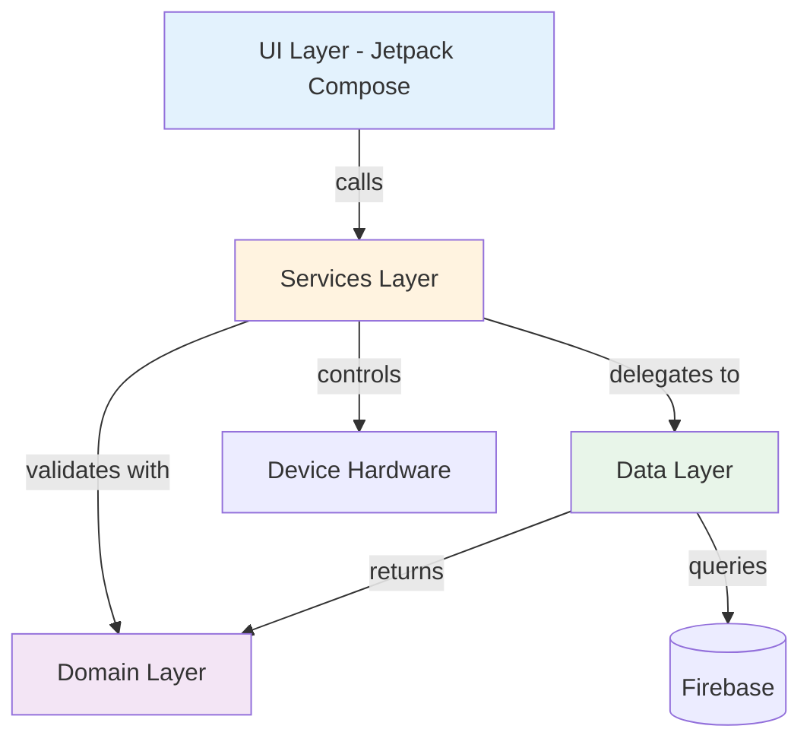
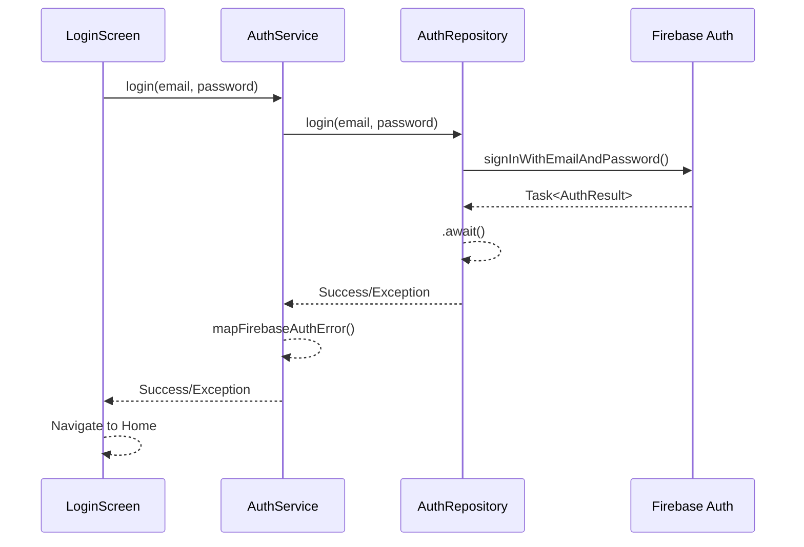

EV Sum 2 is an Android application built with Kotlin and Jetpack Compose that implements a clean, layered architecture using the Service-Repository pattern. The app integrates Firebase services for authentication and data persistence, while leveraging device sensors for voice input and geolocation.

## Design principles

The architecture follows these core principles:

<CardGroup cols={2}>
  <Card title="Separation of concerns" icon="layer-group">
    Each layer has a single, well-defined responsibility with minimal coupling between layers
  </Card>
  <Card title="Testability" icon="flask">
    Business logic is decoupled from the Android framework, enabling fast unit tests
  </Card>
  <Card title="Asynchronous by default" icon="arrows-rotate">
    All data operations use Kotlin Coroutines and Flow to prevent UI thread blocking
  </Card>
  <Card title="Framework independence" icon="box-open">
    Domain logic remains pure Kotlin, independent of Android or Firebase APIs
  </Card>
</CardGroup>

## Architectural layers

The application is organized into four distinct layers that flow from the UI down to data sources:



### UI layer

<Info>
  **Location:** `ui/`
  
  Built entirely with Jetpack Compose and Material Design 3
</Info>

The presentation layer contains all visual components organized by feature:

- **auth/** - Login, registration, and password recovery screens
- **home/** - Main dashboard with phrase CRUD operations
- **location/** - Geolocation display and address lookup
- **nav/** - Navigation graph and routing logic
- **theme/** - Material3 theming configuration

Key characteristics:
- Uses `@Composable` functions for all UI
- Implements reactive state management with `collectAsState()`
- Delegates all business logic to the Services layer
- Handles navigation via Jetpack Navigation Compose

### Services layer

<Info>
  **Location:** `services/`
  
  Acts as intermediary between UI and data/hardware
</Info>

This layer serves two primary purposes:

1. **Data delegation** - Wraps repository calls with error handling and mapping
2. **Hardware abstraction** - Encapsulates Android APIs for speech and location

Key services:

<AccordionGroup>
  <Accordion title="AuthService">
    Manages authentication flow by delegating to `AuthRepository` and mapping Firebase exceptions to user-friendly messages. Exposes reactive authentication state via `Flow<FirebaseUser?>`.
  </Accordion>
  
  <Accordion title="PhraseService">
    Handles phrase CRUD operations with error handling and business logic validation.
  </Accordion>
  
  <Accordion title="LocationService">
    Wraps `FusedLocationProviderClient` and performs reverse geocoding using `Geocoder`. Handles API level differences for Android 13+.
  </Accordion>
  
  <Accordion title="SpeechController">
    Manages `SpeechRecognizer` lifecycle and provides callbacks for partial and final results.
  </Accordion>
  
  <Accordion title="TextToSpeechController">
    Controls Android's TTS engine with Spanish (Chile) locale for accessibility features.
  </Accordion>
</AccordionGroup>

### Domain layer

<Info>
  **Location:** `domain/`
  
  Pure Kotlin with no Android or Firebase dependencies
</Info>

Contains business models and validation logic that can be tested without the Android framework:

- **models/** - Data classes (`AppUser`, `Phrase`, `DeviceLocation`)
- **validators/** - Speech normalization algorithms and input validation
- **errors/** - Custom exception types for error handling

This layer is framework-agnostic, making it:
- Fast to test (no Android SDK required)
- Reusable across platforms
- Independent of external APIs

### Data layer

<Info>
  **Location:** `data/`
  
  Handles all external data sources and persistence
</Info>

The data layer implements the Repository pattern to abstract Firebase and local storage:

- **repositories/** - `AuthRepository`, `PhraseRepository`, `LocationRepository`, `UserRepository`
- **firebase/** - Firebase initialization module
- **session/** - DataStore for local preferences

Key characteristics:
- All operations are suspending functions using Kotlin Coroutines
- Returns domain models, not Firebase objects
- Uses `Flow` for reactive data streams
- Handles Firebase API calls with `.await()` extension

## Data flow example

Here's how data flows through the layers when a user logs in:



<Note>
  All Firebase operations are wrapped in `try-catch` blocks at the Service layer to provide user-friendly error messages.
</Note>

## Asynchronous architecture

The app uses Kotlin Coroutines and Flow throughout:

- **Coroutines** - All repository methods are `suspend` functions
- **Flow** - Authentication state and data streams are reactive
- **Dispatchers** - Operations run on appropriate dispatchers (Main, IO)
- **No blocking** - UI thread is never blocked by data operations

### Authentication state flow

The authentication state is managed reactively:

```kotlin
fun authStateFlow(): Flow<FirebaseUser?> = callbackFlow {
    val listener = FirebaseAuth.AuthStateListener { fa ->
        trySend(fa.currentUser).isSuccess
    }
    auth.addAuthStateListener(listener)
    trySend(auth.currentUser)
    awaitClose { auth.removeAuthStateListener(listener) }
}
```

This pattern:
- Converts Firebase callbacks to Kotlin Flow
- Automatically emits on authentication changes
- Properly cleans up listeners when collected
- Enables reactive UI updates via `collectAsState()`

## Technology stack

<CardGroup cols={2}>
  <Card title="Language" icon="code">
    Kotlin 1.9+ with Coroutines and Flow
  </Card>
  <Card title="UI Framework" icon="mobile">
    Jetpack Compose with Material Design 3
  </Card>
  <Card title="Backend" icon="cloud">
    Firebase Authentication and Firestore
  </Card>
  <Card title="Navigation" icon="route">
    Jetpack Navigation Compose
  </Card>
  <Card title="Location" icon="location-dot">
    Google Play Services FusedLocationProviderClient
  </Card>
  <Card title="Testing" icon="vial">
    JUnit for unit tests
  </Card>
</CardGroup>

## Next steps

<CardGroup cols={2}>
  <Card title="Service-Repository pattern" href="/architecture/service-repository-pattern" icon="diagram-project">
    Deep dive into the Service-Repository pattern implementation
  </Card>
  <Card title="Project structure" href="/architecture/project-structure" icon="folder-tree">
    Detailed directory structure and file organization
  </Card>
</CardGroup>
