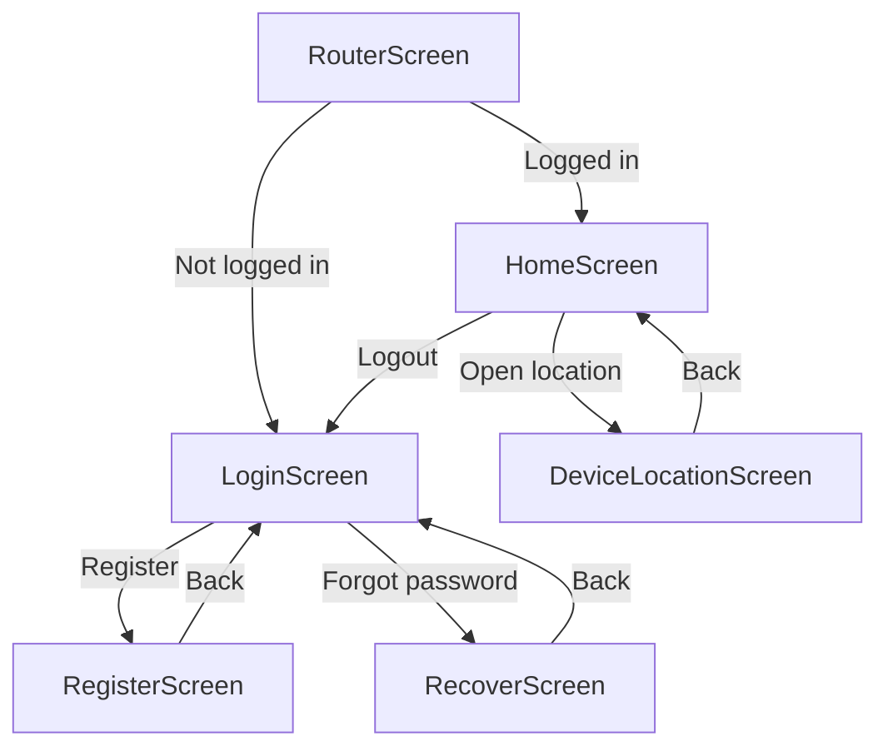

The EV Sum 2 codebase follows a feature-based, layered organization that mirrors the architectural design. This structure makes it easy to locate files and understand the system's organization.

## Root structure

```
app/src/main/java/com/demodogo/ev_sum_2/
├── data/           # Data layer - Repositories and Firebase
├── domain/         # Domain layer - Models and business logic
├── services/       # Service layer - Coordination and hardware
├── ui/             # UI layer - Jetpack Compose screens
└── MainActivity.kt # Application entry point
```

<Info>
  The package name `com.demodogo.ev_sum_2` represents the application identifier. All code is organized under this namespace.
</Info>

## Data layer

The data layer contains all code related to data access and persistence:

```
data/
├── firebase/
│   └── FirebaseModule.kt      # Firebase initialization
├── repositories/
│   ├── AuthRepository.kt      # Authentication data access
│   ├── PhraseRepository.kt    # Phrase CRUD operations
│   ├── LocationRepository.kt  # Geolocation data access
│   └── UserRepository.kt      # User data management
├── session/
│   └── SessionStore.kt        # Session persistence
├── ThemeStore.kt              # Theme preferences
├── UserStore.kt               # User preferences
└── Validators.kt              # Data validation utilities
```

### Key files

<AccordionGroup>
  <Accordion title="FirebaseModule.kt">
    Initializes Firebase services and provides singleton instances of `FirebaseAuth` and `FirebaseFirestore`.
    
    **Purpose:** Centralized Firebase configuration  
    **Dependencies:** Firebase SDK
  </Accordion>
  
  <Accordion title="AuthRepository.kt">
    Manages Firebase Authentication operations including login, registration, password reset, and session state.
    
    **Key methods:**
    - `suspend fun login(email: String, password: String)`
    - `suspend fun register(email: String, password: String)`
    - `fun authStateFlow(): Flow<FirebaseUser?>`
    
    **Location:** `data/repositories/AuthRepository.kt:1`
  </Accordion>
  
  <Accordion title="PhraseRepository.kt">
    Handles CRUD operations for phrases in Firestore. Automatically scopes data to the current user's UID.
    
    **Key methods:**
    - `suspend fun add(text: String)`
    - `suspend fun get(): List<Phrase>`
    - `suspend fun update(id: String, newText: String)`
    - `suspend fun delete(id: String)`
    
    **Location:** `data/repositories/PhraseRepository.kt:1`
  </Accordion>
  
  <Accordion title="LocationRepository.kt">
    Wraps Google Play Services FusedLocationProviderClient to access device GPS coordinates.
    
    **Key methods:**
    - `fun hasPermission(): Boolean`
    - `suspend fun getLatLng(): Pair<Double, Double>`
  </Accordion>
  
  <Accordion title="SessionStore.kt">
    Uses DataStore Preferences API for local key-value storage. Stores session-related data.
  </Accordion>
</AccordionGroup>

## Domain layer

The domain layer contains pure Kotlin code with no Android or Firebase dependencies:

```
domain/
├── errors/
│   ├── AppException.kt        # Base exception class
│   ├── AuthException.kt       # Authentication errors
│   └── DataException.kt       # Data operation errors
├── models/
│   ├── AppUser.kt             # User domain model
│   ├── Phrase.kt              # Phrase domain model
│   ├── DeviceLocation.kt      # Location coordinates model
│   ├── Message.kt             # UI message model
│   └── DictationTarget.kt     # Speech input target enum
└── validators/
    ├── SpeechNormalization.kt # Speech-to-text normalization
    └── Validators.kt          # Input validation functions
```

### Key files

<AccordionGroup>
  <Accordion title="Phrase.kt">
    Represents a user-created phrase with metadata.
    
    ```kotlin
    data class Phrase(
        val id: String = "",
        val text: String = "",
        val createdAtMillis: Long = 0L
    )
    ```
    
    **Location:** `domain/models/Phrase.kt:1`
  </Accordion>
  
  <Accordion title="DeviceLocation.kt">
    Represents GPS coordinates.
    
    ```kotlin
    data class DeviceLocation(
        val latitude: Double,
        val longitude: Double
    )
    ```
  </Accordion>
  
  <Accordion title="SpeechNormalization.kt">
    Contains algorithms for converting spoken Spanish to text suitable for email/password fields.
    
    **Key functions:**
    - `normalizeEmailFromSpeech(input: String): String`
    - `normalizePasswordFromSpeech(input: String): String`
    
    **Transforms:**
    - "arroba" → "@"
    - "punto" → "."
    - "guion bajo" → "_"
    - "uno" → "1"
    
    **Location:** `domain/validators/SpeechNormalization.kt:1`
  </Accordion>
  
  <Accordion title="AppException.kt / AuthException.kt / DataException.kt">
    Domain-specific exception classes for error handling throughout the application.
  </Accordion>
</AccordionGroup>

<Note>
  The domain layer can be tested with standard JUnit without requiring the Android framework or Firebase emulators.
</Note>

## Service layer

The service layer coordinates between UI and data, and controls device hardware:

```
services/
├── AuthService.kt             # Authentication coordination
├── PhraseService.kt           # Phrase business logic
├── UserService.kt             # User management
├── LocationService.kt         # Location + geocoding
├── SpeechController.kt        # Speech recognition control
└── TextToSpeechController.kt  # TTS control
```

### Key files

<AccordionGroup>
  <Accordion title="AuthService.kt">
    Orchestrates authentication flow with error mapping.
    
    **Key methods:**
    - `suspend fun login(email: String, password: String)`
    - `suspend fun register(email: String, password: String)`
    - `suspend fun recover(email: String)`
    - `fun authStateFlow(): Flow<FirebaseUser?>`
    
    **Location:** `services/AuthService.kt:1`
  </Accordion>
  
  <Accordion title="LocationService.kt">
    Combines GPS coordinates with reverse geocoding to provide location + address.
    
    **Key methods:**
    - `fun hasPermission(): Boolean`
    - `suspend fun getLocationWithAddress(): LocationResult`
    - `private suspend fun reverseGeocodeSafe(lat: Double, lon: Double): String?`
    
    **Handles:** API level differences for Android 13+ Geocoder callbacks  
    **Location:** `services/LocationService.kt:1`
  </Accordion>
  
  <Accordion title="SpeechController.kt">
    Wraps Android's SpeechRecognizer for voice input.
    
    **Key methods:**
    - `fun setListener(onReady, onPartial, onFinal, onError, onEnd)`
    - `fun start()`
    - `fun stop()`
    - `fun destroy()`
    
    **Locale:** Spanish (Chile) - "es-CL"  
    **Location:** `services/SpeechController.kt:1`
  </Accordion>
  
  <Accordion title="TextToSpeechController.kt">
    Controls Android's TTS engine for accessibility.
    
    **Key methods:**
    - `fun speak(text: String)`
    - `fun stop()`
    - `fun destroy()`
    
    **Configuration:** Uses `QUEUE_FLUSH` to prevent audio overlap  
    **Location:** `services/TextToSpeechController.kt:1`
  </Accordion>
</AccordionGroup>

## UI layer

The UI layer is built entirely with Jetpack Compose and organized by feature:

```
ui/
├── auth/
│   ├── LoginScreen.kt         # Login with email/password
│   ├── RegisterScreen.kt      # Account creation
│   └── RecoverScreen.kt       # Password recovery
├── home/
│   └── HomeScreen.kt          # Main dashboard with phrase CRUD
├── location/
│   └── DeviceLocationScreen.kt # GPS coordinates + address
├── nav/
│   ├── AppNavGraph.kt         # Navigation graph definition
│   ├── RouterScreen.kt        # Authentication routing
│   └── AppRoutes.kt           # Route constants
└── theme/
    ├── Theme.kt               # Material3 theme configuration
    ├── Color.kt               # Color palette
    └── Type.kt                # Typography definitions
```

### Navigation structure

<Info>
  The app uses Jetpack Navigation Compose with a router pattern for authentication-aware navigation.
</Info>

#### AppRoutes.kt

Defines route constants:

```kotlin
object AppRoutes {
    const val LOGIN = "login"
    const val REGISTER = "register"
    const val RECOVER = "recover"
    const val HOME = "home"
    const val LOCATION = "location"
}
```

#### AppNavGraph.kt

Defines the navigation graph with reactive authentication state:



**Key features:**
- Reactive authentication state using `authStateFlow().collectAsState()`
- Automatic redirection based on login status
- Proper back stack management with `popUpTo`

**Location:** `ui/nav/AppNavGraph.kt:1`

#### RouterScreen.kt

Handles automatic navigation based on authentication state:

```kotlin
@Composable
fun RouterScreen(
    isLoggedIn: Boolean,
    onGoHome: () -> Unit,
    onGoLogin: () -> Unit
) {
    LaunchedEffect(isLoggedIn) {
        if (isLoggedIn) onGoHome() else onGoLogin()
    }
    // Loading indicator while deciding route
}
```

### Screen components

<Tabs>
  <Tab title="Authentication">
    **LoginScreen.kt**
    - Email and password input fields
    - Voice dictation for email/password
    - Speech normalization integration
    - Navigation to register/recover screens
    
    **RegisterScreen.kt**
    - New account creation
    - Password confirmation
    - Voice input support
    
    **RecoverScreen.kt**
    - Password reset email
    - Firebase sendPasswordResetEmail integration
  </Tab>
  
  <Tab title="Main features">
    **HomeScreen.kt**
    - Displays list of user phrases
    - Create, edit, delete operations
    - Text-to-speech playback
    - Navigation to location screen
    - Logout functionality
    
    **Features:**
    - Real-time phrase list updates
    - Timestamp-based ordering
    - TTS integration for accessibility
  </Tab>
  
  <Tab title="Location">
    **DeviceLocationScreen.kt**
    - Displays GPS coordinates (lat/lng)
    - Shows reverse geocoded address
    - Copy to clipboard functionality
    - Permission handling
    
    **Integration:**
    - LocationService for data
    - Runtime permission requests
    - Error handling for denied permissions
  </Tab>
</Tabs>

## Testing structure

```
app/src/test/java/com/demodogo/ev_sum_2/
├── domain/
│   └── validators/
│       └── SpeechNormalizersTest.kt  # Unit tests for speech normalization
└── ExampleUnitTest.kt

app/src/androidTest/java/com/demodogo/ev_sum_2/
└── ExampleInstrumentedTest.kt
```

### SpeechNormalizersTest.kt

Comprehensive test suite for speech-to-text normalization:

<CardGroup cols={2}>
  <Card title="Email normalization tests" icon="at">
    Tests conversion of spoken email addresses including "arroba", "punto", and numeric spellings
  </Card>
  <Card title="Password normalization tests" icon="key">
    Validates password input from voice with special characters and numbers
  </Card>
  <Card title="Edge cases" icon="triangle-exclamation">
    Tests spacing, special characters, and phonetic variations
  </Card>
  <Card title="100% coverage" icon="check">
    Ensures all normalization paths are validated
  </Card>
</CardGroup>

**Location:** `app/src/test/java/com/demodogo/ev_sum_2/domain/validators/SpeechNormalizersTest.kt:1`

## Configuration files

### Build configuration

```
app/
├── build.gradle.kts           # App-level Gradle configuration
└── google-services.json       # Firebase project configuration (gitignored)

build.gradle.kts               # Project-level Gradle configuration
```

#### Key dependencies (build.gradle.kts)

<Tabs>
  <Tab title="Jetpack Compose">
    ```kotlin
    implementation("androidx.activity:activity-compose:1.9.2")
    implementation("androidx.compose.material3:material3:1.3.0")
    implementation("androidx.compose.material:material-icons-extended:1.7.6")
    implementation(platform(libs.androidx.compose.bom))
    ```
  </Tab>
  
  <Tab title="Navigation">
    ```kotlin
    implementation("androidx.navigation:navigation-compose:2.8.5")
    ```
  </Tab>
  
  <Tab title="Firebase">
    ```kotlin
    implementation(platform("com.google.firebase:firebase-bom:33.7.0"))
    implementation("com.google.firebase:firebase-auth-ktx")
    implementation("com.google.firebase:firebase-firestore-ktx")
    implementation("org.jetbrains.kotlinx:kotlinx-coroutines-play-services:1.8.1")
    ```
  </Tab>
  
  <Tab title="Location & Storage">
    ```kotlin
    implementation("com.google.android.gms:play-services-location:21.3.0")
    implementation("androidx.datastore:datastore-preferences:1.1.1")
    ```
  </Tab>
</Tabs>

**SDK versions:**
- `compileSdk = 36`
- `minSdk = 24`
- `targetSdk = 36`
- Kotlin JVM target: `11`

### Manifest configuration

Required permissions declared in `AndroidManifest.xml`:

```xml
<uses-permission android:name="android.permission.RECORD_AUDIO" />
<uses-permission android:name="android.permission.ACCESS_FINE_LOCATION" />
<uses-permission android:name="android.permission.ACCESS_COARSE_LOCATION" />
```

<Warning>
  All permissions are requested at runtime. The app handles denied permissions gracefully.
</Warning>

## File naming conventions

<CardGroup cols={2}>
  <Card title="Screens" icon="display">
    `FeatureScreen.kt` (e.g., `LoginScreen.kt`, `HomeScreen.kt`)
  </Card>
  <Card title="Repositories" icon="database">
    `EntityRepository.kt` (e.g., `AuthRepository.kt`, `PhraseRepository.kt`)
  </Card>
  <Card title="Services" icon="gear">
    `EntityService.kt` or `FeatureController.kt`
  </Card>
  <Card title="Models" icon="cube">
    `EntityName.kt` (e.g., `Phrase.kt`, `AppUser.kt`)
  </Card>
  <Card title="Tests" icon="flask">
    `ClassNameTest.kt` (e.g., `SpeechNormalizersTest.kt`)
  </Card>
</CardGroup>

## Package organization principles

<Steps>
  <Step title="Layer-first organization">
    Top-level packages represent architectural layers (`data`, `domain`, `services`, `ui`)
  </Step>
  <Step title="Feature grouping within UI">
    UI components are grouped by feature (`auth`, `home`, `location`)
  </Step>
  <Step title="Shared utilities at layer root">
    Common utilities live at the root of their layer (e.g., `data/Validators.kt`)
  </Step>
  <Step title="Consistent naming">
    File names clearly indicate their role (Repository, Service, Screen, Controller)
  </Step>
</Steps>

## Quick reference

Use this guide to quickly locate specific functionality:

| Feature | Layer | File |
|---------|-------|------|
| User login | Data | `data/repositories/AuthRepository.kt:15` |
| Login UI | UI | `ui/auth/LoginScreen.kt` |
| Login coordination | Services | `services/AuthService.kt:11` |
| Phrase CRUD | Data | `data/repositories/PhraseRepository.kt:17` |
| GPS location | Data | `data/repositories/LocationRepository.kt` |
| Reverse geocoding | Services | `services/LocationService.kt:39` |
| Voice recognition | Services | `services/SpeechController.kt:54` |
| Speech normalization | Domain | `domain/validators/SpeechNormalization.kt:4` |
| Text-to-speech | Services | `services/TextToSpeechController.kt:20` |
| Navigation graph | UI | `ui/nav/AppNavGraph.kt:19` |
| Theme configuration | UI | `ui/theme/Theme.kt` |
| Firebase init | Data | `data/firebase/FirebaseModule.kt` |

## Next steps

<CardGroup cols={2}>
  <Card title="Architecture overview" href="/architecture/overview" icon="diagram-project">
    Review the high-level architecture and design principles
  </Card>
  <Card title="Service-Repository pattern" href="/architecture/service-repository-pattern" icon="gear">
    Learn about the architectural pattern implementation
  </Card>
</CardGroup>
