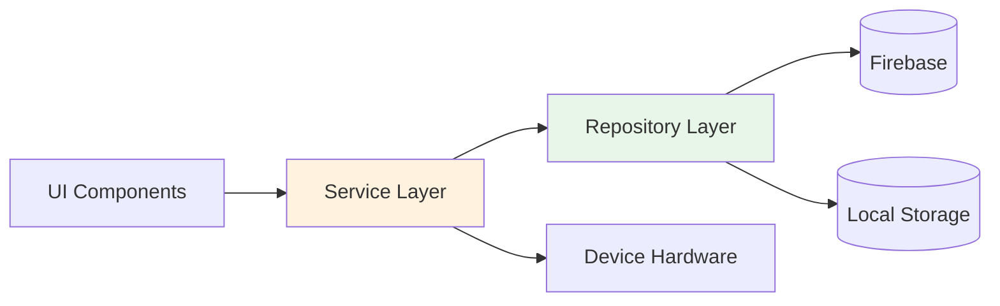
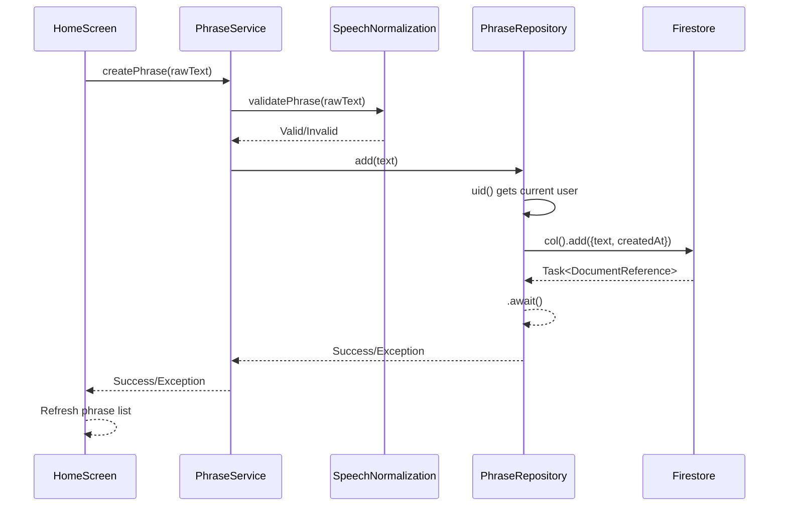

EV Sum 2 implements a Service-Repository pattern that separates concerns between business logic coordination (Services) and data access (Repositories). This pattern provides a clean architecture with clear boundaries and responsibilities.

## Pattern overview

The Service-Repository pattern splits the traditional "business logic layer" into two distinct layers:



<CardGroup cols={2}>
  <Card title="Service Layer" icon="gear">
    Orchestrates business logic, validates input, handles errors, and controls device hardware
  </Card>
  <Card title="Repository Layer" icon="database">
    Abstracts data sources, manages Firebase queries, and returns domain models
  </Card>
</CardGroup>

## Why this pattern?

This architecture solves several common Android development challenges:

<AccordionGroup>
  <Accordion title="Separation of concerns">
    Services handle business logic and coordination, while Repositories focus solely on data access. This makes each component easier to understand and modify.
  </Accordion>
  
  <Accordion title="Testability">
    Services can be tested by mocking Repositories. Repositories can be tested independently of Firebase using test doubles.
  </Accordion>
  
  <Accordion title="Hardware abstraction">
    Device-specific APIs (Speech, TTS, Location) are isolated in Services, keeping the UI layer framework-agnostic.
  </Accordion>
  
  <Accordion title="Error handling">
    Services translate Firebase exceptions into domain-specific errors that the UI can present to users.
  </Accordion>
  
  <Accordion title="Reusability">
    Repositories can be shared across multiple Services. Services can be used by different UI components.
  </Accordion>
</AccordionGroup>

## Repository layer

Repositories are responsible for **data access only**. They know how to fetch and persist data, but contain no business logic.

### Key characteristics

<Note>
  All repository methods are `suspend` functions that use Kotlin Coroutines for asynchronous operations.
</Note>

1. **Single data source per repository** - Each repository manages one domain entity
2. **Returns domain models** - Converts Firebase objects to domain models
3. **No error mapping** - Throws exceptions as-is for Services to handle
4. **Framework-specific** - Can use Firebase, Room, DataStore, or other Android APIs

### Example: AuthRepository

Let's examine the authentication repository:

```kotlin /home/daytona/workspace/source/app/src/main/java/com/demodogo/ev_sum_2/data/repositories/AuthRepository.kt
class AuthRepository(
    private val auth: FirebaseAuth = FirebaseAuth.getInstance(),
) {
    // Suspend function for async operation
    suspend fun login(email: String, password: String) {
        auth.signInWithEmailAndPassword(email, password).await()
        auth.currentUser != null
    }

    suspend fun register(email: String, password: String) {
        auth.createUserWithEmailAndPassword(email, password).await()
    }

    suspend fun sendPasswordReset(email: String) {
        auth.sendPasswordResetEmail(email).await()
    }

    fun logout() {
        FirebaseModule.auth.signOut()
    }

    // Reactive state using Flow
    fun authStateFlow(): Flow<FirebaseUser?> = callbackFlow {
        val listener = FirebaseAuth.AuthStateListener { fa ->
            trySend(fa.currentUser).isSuccess
        }
        auth.addAuthStateListener(listener)
        trySend(auth.currentUser)
        awaitClose { auth.removeAuthStateListener(listener) }
    }

    fun isLoggedIn(): Boolean = auth.currentUser != null
    fun currentEmail(): String? = auth.currentUser?.email
}
```

<Accordion title="Key design decisions">
  - **`.await()` extension** - Converts Firebase `Task` to suspending function
  - **`callbackFlow`** - Transforms Firebase listeners into Kotlin Flow
  - **No error handling** - Exceptions propagate to the Service layer
  - **Default parameters** - `FirebaseAuth.getInstance()` for easy testing with DI
</Accordion>

### Example: PhraseRepository

The phrase repository demonstrates CRUD operations with Firestore:

```kotlin /home/daytona/workspace/source/app/src/main/java/com/demodogo/ev_sum_2/data/repositories/PhraseRepository.kt
class PhraseRepository(
    private val db: FirebaseFirestore = FirebaseFirestore.getInstance(),
    private val auth: FirebaseAuth = FirebaseAuth.getInstance()
) {
    private fun uid(): String = 
        auth.currentUser?.uid ?: throw IllegalStateException("No hay sesión activa")

    private fun col() = 
        db.collection("users").document(uid()).collection("phrases")

    suspend fun add(text: String) {
        col().add(
            mapOf(
                "text" to text,
                "createdAt" to System.currentTimeMillis()
            )
        ).await()
    }

    suspend fun get(): List<Phrase> {
        val snap = col()
            .orderBy("createdAt", Query.Direction.DESCENDING)
            .get()
            .await()

        return snap.documents.map { d ->
            Phrase(
                id = d.id,
                text = d.getString("text") ?: "",
                createdAtMillis = d.getLong("createdAt") ?: 0L
            )
        }
    }

    suspend fun update(id: String, newText: String) {
        col().document(id).update(mapOf("text" to newText)).await()
    }

    suspend fun delete(id: String) {
        col().document(id).delete().await()
    }
}
```

<Info>
  The repository automatically scopes phrases to the current user by using their Firebase Auth UID in the Firestore path.
</Info>

Key patterns:
- **User scoping** - Data is automatically isolated per user
- **Timestamp ordering** - Phrases are sorted by creation time (newest first)
- **Domain model mapping** - Firestore documents are converted to `Phrase` objects
- **Complete CRUD** - Create, Read, Update, Delete operations

### Example: LocationRepository

The location repository abstracts Google Play Services:

```kotlin /home/daytona/workspace/source/app/src/main/java/com/demodogo/ev_sum_2/data/repositories/LocationRepository.kt
class LocationRepository(private val context: Context) {
    private val client = LocationServices.getFusedLocationProviderClient(context)

    fun hasPermission(): Boolean {
        return ActivityCompat.checkSelfPermission(
            context,
            Manifest.permission.ACCESS_FINE_LOCATION
        ) == PackageManager.PERMISSION_GRANTED
    }

    @RequiresPermission(anyOf = [
        Manifest.permission.ACCESS_FINE_LOCATION,
        Manifest.permission.ACCESS_COARSE_LOCATION
    ])
    suspend fun getLatLng(): Pair<Double, Double> {
        val location = client.lastLocation.await()
            ?: throw IllegalStateException("No se pudo obtener ubicación")
        return Pair(location.latitude, location.longitude)
    }
}
```

## Service layer

Services orchestrate business logic by coordinating between Repositories, validating input, handling errors, and controlling device hardware.

### Key characteristics

1. **Delegates to repositories** - Services don't access data directly
2. **Error mapping** - Converts framework exceptions to user-friendly messages
3. **Hardware control** - Manages Android APIs like Speech and TTS
4. **Business validation** - Uses domain validators before calling repositories
5. **Coordination** - Can call multiple repositories for complex operations

### Example: AuthService

The authentication service adds error handling to repository calls:

```kotlin /home/daytona/workspace/source/app/src/main/java/com/demodogo/ev_sum_2/services/AuthService.kt
class AuthService(
    private val repo: AuthRepository = AuthRepository(),
) {
    suspend fun login(email: String, password: String) {
        try {
            repo.login(email, password)
        } catch (e: Exception) {
            throw mapFirebaseAuthError(e)
        }
    }

    suspend fun register(email: String, password: String) {
        try {
            repo.register(email, password)
        } catch (e: Exception) {
            throw mapFirebaseAuthError(e)
        }
    }

    suspend fun recover(email: String) {
        try {
            repo.sendPasswordReset(email)
        } catch (e: Exception) {
            throw mapFirebaseAuthError(e)
        }
    }

    fun logout() = repo.logout()
    fun isLoggedIn(): Boolean = repo.isLoggedIn()
    fun authStateFlow(): Flow<FirebaseUser?> = repo.authStateFlow()
    fun currentEmail(): String? = repo.currentEmail()

    private fun mapFirebaseAuthError(e: Exception): Exception {
        val msg = e.message ?: "Error de autenticación"
        return Exception(msg)
    }
}
```

<Note>
  The Service layer catches exceptions from the Repository and maps them to user-friendly error messages. This keeps Firebase implementation details out of the UI.
</Note>

### Example: LocationService

This service demonstrates hardware abstraction and coordination:

```kotlin /home/daytona/workspace/source/app/src/main/java/com/demodogo/ev_sum_2/services/LocationService.kt
data class LocationResult(
    val coords: DeviceLocation,
    val address: String?
)

class LocationService(private val context: Context) {
    private val repo = LocationRepository(context)

    fun hasPermission(): Boolean = repo.hasPermission()

    @RequiresPermission(anyOf = [
        Manifest.permission.ACCESS_FINE_LOCATION,
        Manifest.permission.ACCESS_COARSE_LOCATION
    ])
    suspend fun getLocationWithAddress(): LocationResult {
        return try {
            val (lat, lng) = repo.getLatLng()
            val address = reverseGeocodeSafe(lat, lng)
            LocationResult(DeviceLocation(lat, lng), address)
        } catch (e: SecurityException) {
            throw IllegalStateException("Permiso de ubicación no concedido.", e)
        }
    }

    private suspend fun reverseGeocodeSafe(lat: Double, lon: Double): String? {
        return try {
            val geocoder = Geocoder(context, Locale.forLanguageTag("es-CL"))
            if (Build.VERSION.SDK_INT >= 33) {
                suspendCancellableCoroutine { cont ->
                    geocoder.getFromLocation(lat, lon, 1) { results ->
                        if (!cont.isActive) return@getFromLocation
                        val line = results.firstOrNull()?.getAddressLine(0)
                        cont.resume(line)
                    }
                }
            } else {
                @Suppress("DEPRECATION")
                geocoder.getFromLocation(lat, lon, 1)
                    ?.firstOrNull()
                    ?.getAddressLine(0)
            }
        } catch (_: Exception) {
            null
        }
    }
}
```

This service:
- Coordinates between `LocationRepository` and `Geocoder`
- Handles API level differences (Android 13+ uses callbacks)
- Converts exceptions to domain errors
- Returns a composite result with coordinates and address

### Hardware controllers

Some services are pure hardware controllers with no repository:

<AccordionGroup>
  <Accordion title="SpeechController">
    Wraps Android's `SpeechRecognizer` to provide voice input. Manages lifecycle and provides callbacks for partial and final results.
    
    ```kotlin
    class SpeechController(context: Context) {
        private val recognizer = SpeechRecognizer.createSpeechRecognizer(context)
        
        fun setListener(
            onReady: () -> Unit,
            onPartial: (String) -> Unit,
            onFinal: (String) -> Unit,
            onError: (Int) -> Unit,
            onEnd: () -> Unit
        )
        
        fun start()
        fun stop()
        fun destroy()
    }
    ```
  </Accordion>
  
  <Accordion title="TextToSpeechController">
    Controls Android's TTS engine for accessibility. Configured for Spanish (Chile) locale.
    
    ```kotlin
    class TextToSpeechController(context: Context) {
        private var tts: TextToSpeech?
        private var ready: Boolean
        
        fun speak(text: String)
        fun stop()
        fun destroy()
    }
    ```
  </Accordion>
</AccordionGroup>

## Pattern comparison

Here's how the Service-Repository pattern compares to other approaches:

<Tabs>
  <Tab title="Service-Repository">
    **Pros:**
    - Clear separation between coordination and data access
    - Services can coordinate multiple repositories
    - Hardware abstraction is separated from data access
    - Easy to test each layer independently
    
    **Cons:**
    - More files and layers than simpler patterns
    - Potential for thin Services that just delegate
  </Tab>
  
  <Tab title="Direct Repository">
    **Pros:**
    - Fewer layers and files
    - Simpler for small apps
    
    **Cons:**
    - UI becomes responsible for error handling
    - Business logic leaks into UI layer
    - Harder to coordinate multiple data sources
  </Tab>
  
  <Tab title="ViewModel + Repository">
    **Pros:**
    - Standard Android pattern
    - Good for simple CRUD apps
    
    **Cons:**
    - ViewModels can become large with complex logic
    - Hardware abstraction is unclear
    - Harder to reuse logic across ViewModels
  </Tab>
</Tabs>

## Data flow through the pattern

Here's a complete example of creating a phrase:



<Steps>
  <Step title="UI calls Service">
    The UI component invokes the service method with user input
  </Step>
  <Step title="Service validates">
    The service uses domain validators to check input before proceeding
  </Step>
  <Step title="Service delegates to Repository">
    After validation, the service calls the repository to persist data
  </Step>
  <Step title="Repository queries Firebase">
    The repository constructs and executes the Firebase operation
  </Step>
  <Step title="Repository awaits result">
    The `.await()` extension suspends until Firebase completes
  </Step>
  <Step title="Service handles errors">
    Any exceptions are caught and mapped to user-friendly messages
  </Step>
  <Step title="UI updates">
    The UI receives the result and updates its state accordingly
  </Step>
</Steps>

## Best practices

Follow these guidelines when implementing the pattern:

<CardGroup cols={2}>
  <Card title="Keep Repositories focused" icon="bullseye">
    Each repository should manage exactly one domain entity or data source
  </Card>
  <Card title="Services coordinate" icon="shuffle">
    Services can call multiple repositories but shouldn't access data directly
  </Card>
  <Card title="Use domain models" icon="cube">
    Repositories return domain models, not Firebase or Room objects
  </Card>
  <Card title="Error mapping in Services" icon="triangle-exclamation">
    Repositories throw raw exceptions; Services map them to domain errors
  </Card>
  <Card title="Hardware in Services" icon="microchip">
    Device APIs (Speech, Location, TTS) belong in the Service layer
  </Card>
  <Card title="Suspend everything async" icon="clock">
    Use `suspend` functions and Flow for all asynchronous operations
  </Card>
</CardGroup>

## Testing strategy

<Tabs>
  <Tab title="Repository tests">
    Test repositories with Firebase emulators or mock Firebase instances:
    
    ```kotlin
    @Test
    fun `login with valid credentials succeeds`() = runBlocking {
        val repo = AuthRepository(mockFirebaseAuth)
        repo.login("test@example.com", "password123")
        verify(mockFirebaseAuth).signInWithEmailAndPassword(any(), any())
    }
    ```
  </Tab>
  
  <Tab title="Service tests">
    Test services by mocking repositories:
    
    ```kotlin
    @Test
    fun `login with invalid credentials throws exception`() = runBlocking {
        val mockRepo = mock<AuthRepository>()
        whenever(mockRepo.login(any(), any()))
            .thenThrow(FirebaseAuthException("ERROR", "Invalid"))
        
        val service = AuthService(mockRepo)
        assertThrows<Exception> {
            service.login("bad@email.com", "wrong")
        }
    }
    ```
  </Tab>
  
  <Tab title="Domain tests">
    Test domain logic without any mocks:
    
    ```kotlin
    @Test
    fun `normalizeEmailFromSpeech converts arroba to @`() {
        val result = normalizeEmailFromSpeech("test arroba example punto com")
        assertEquals("test@example.com", result)
    }
    ```
  </Tab>
</Tabs>

<Note>
  The app includes comprehensive unit tests for speech normalization in `SpeechNormalizersTest.kt` that validate all phonetic combinations.
</Note>

## Next steps

<Card title="Project structure" href="/architecture/project-structure" icon="folder-tree">
  Explore the complete directory structure and file organization
</Card>
